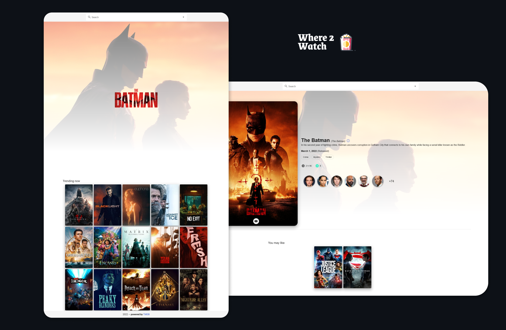

# Where2watch

See live at [hellow2w.netlify.app/](https://hellow2w.netlify.app/)

## Tech Stack

 - Framework : [VueJS](http://www.vuejs.org)
 - UI Library : [Vuetify](https://vuetifyjs.com/)
 - Content : [TMDB API](https://developers.themoviedb.org/3/)
 - Deployment: [Netlify](https://netlify.app/)
 
## Screenshots



## Project setup
```
npm install
```

### Compiles and hot-reloads for development
```
npm run serve
```

### Compiles and minifies for production
```
npm run build
```

### Lints and fixes files
```
npm run lint
```

### Customize configuration
See [Configuration Reference](https://cli.vuejs.org/config/).
